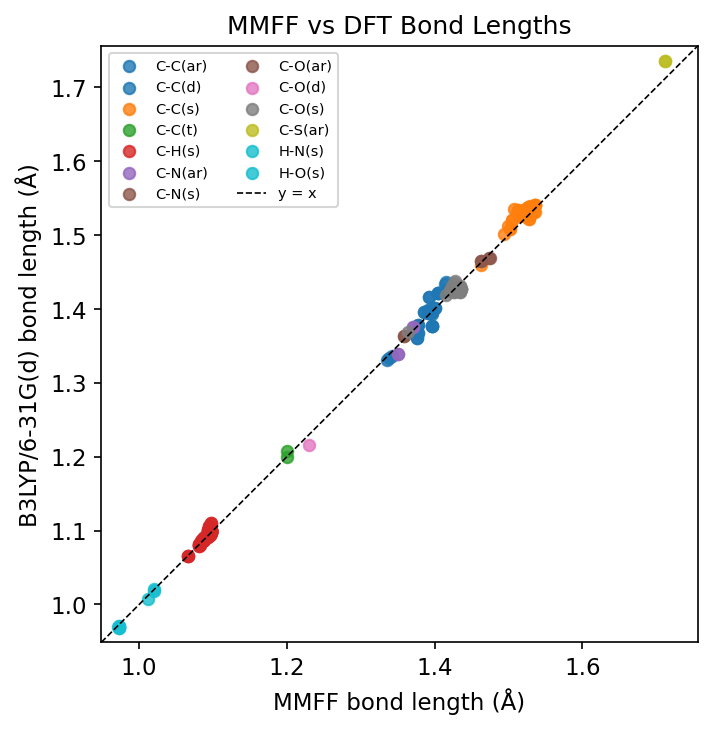
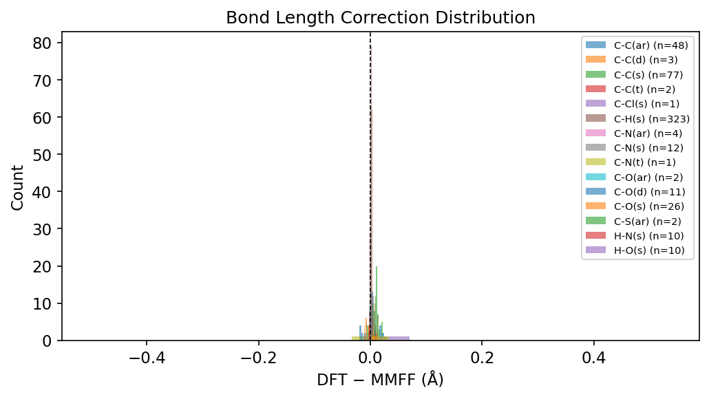
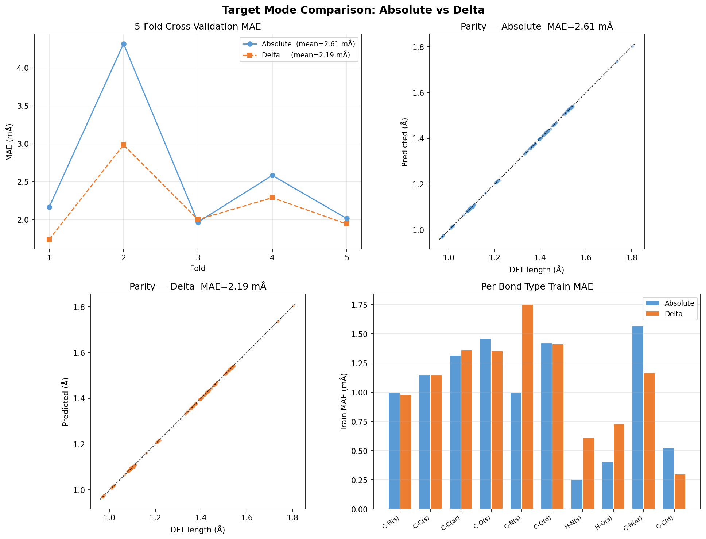
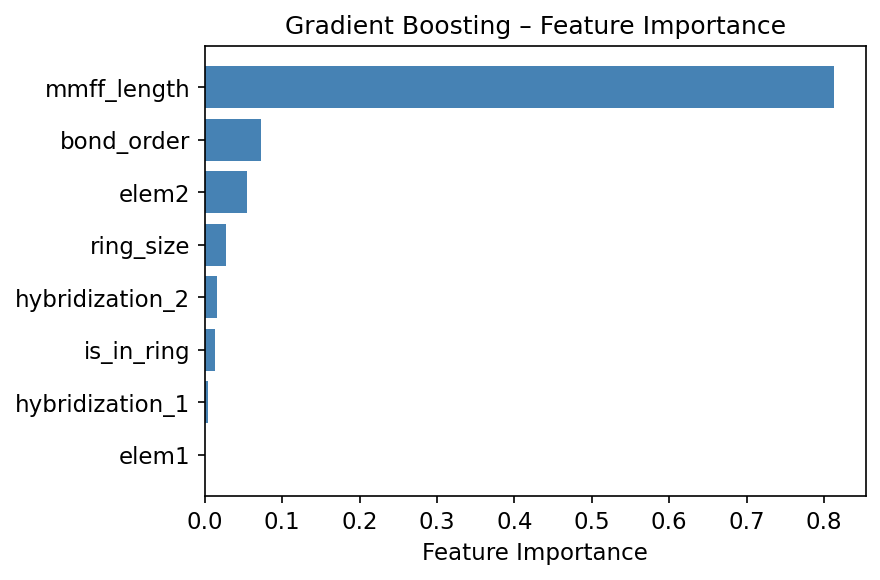
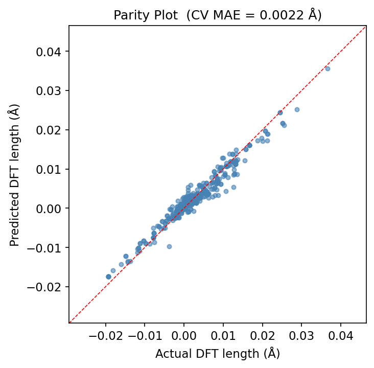
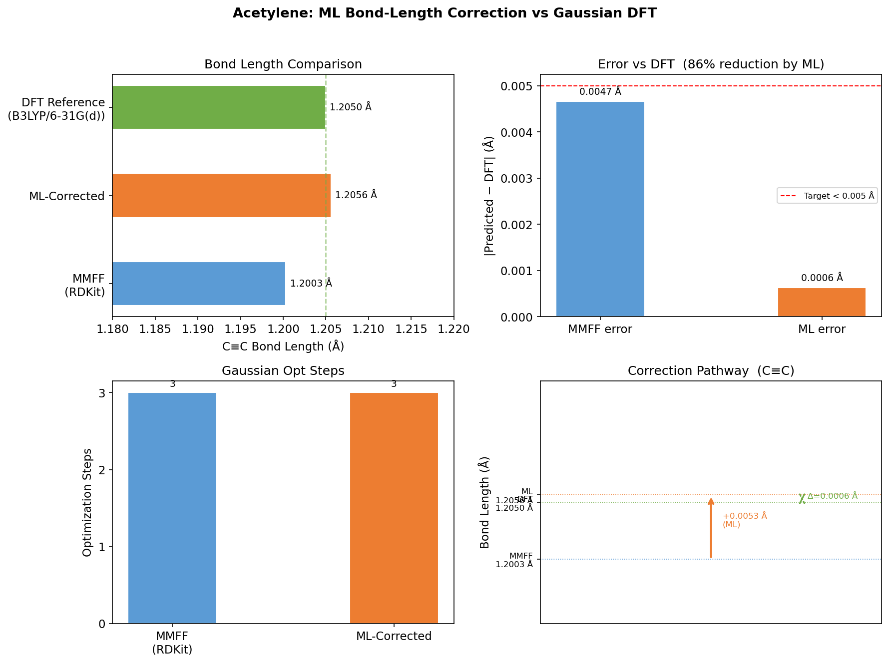
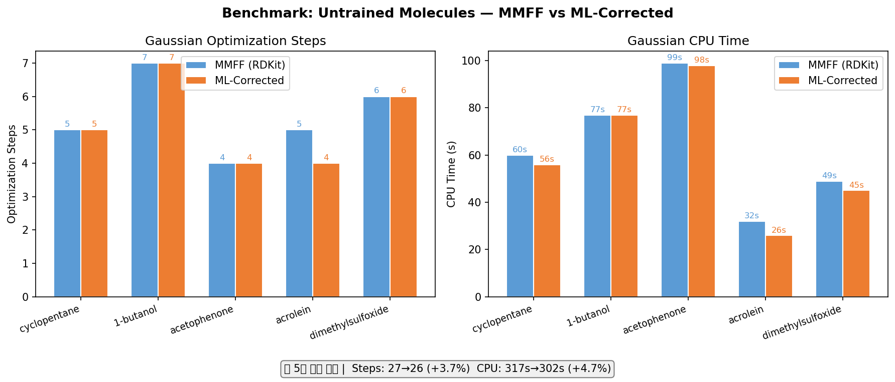

# delta_opt_learning

**MMFF → B3LYP/6-31G(d) 결합 길이 보정을 통한 Gaussian DFT 기하 최적화 가속**

학부 연구 프로젝트 | B3LYP/6-31G(d) | Python · RDKit · Gaussian 09 · scikit-learn

---

## 개요

Gaussian 09를 이용한 DFT(Density Functional Theory) 기하 최적화는 초기 구조의 품질에 따라 수렴 속도가 크게 달라진다. 일반적으로 사용되는 RDKit ETKDG+MMFF 초기 구조는 간편하지만, MMFF 포스필드의 평형 결합 길이가 B3LYP/6-31G(d) 수준의 값과 체계적인 차이를 보인다.

본 프로젝트는 이 차이를 **Gradient Boosting 머신러닝 모델**로 학습하여, Gaussian 실행 전 초기 구조를 보정함으로써 최적화 스텝 수와 계산 시간을 줄이는 것을 목표로 한다.

---

## 파이프라인

```
SMILES
  │
  ▼
RDKit ETKDG + MMFF 최적화        ← 초기 3D 구조 생성
  │
  ▼
ML Bond Length Correction        ← 결합 유형별 MMFF→DFT 보정
  │
  ▼
Gaussian 09 B3LYP/6-31G(d) opt  ← 실제 DFT 최적화
```

### 빠른 시작

```bash
# 환경 생성
conda env create -f environment.yml
conda run -n delta_chem pip install -e .

# SMILES → Gaussian .com (ML 보정 포함)
conda run -n delta_chem python scripts/pipeline.py "CCO" --name ethanol --ml-correct

# 전체 데이터 수집 (Gaussian 필요)
conda run -n delta_chem python scripts/collect_data.py

# Feature 추출 → 모델 학습
conda run -n delta_chem python scripts/extract_features.py
conda run -n delta_chem python scripts/train_model.py --exclude acetylene

# 벤치마크
conda run -n delta_chem python scripts/benchmark_new_mols.py
```

---

## 방법론

### 1. 훈련 데이터 생성

49종의 단순 유기 분자(알케인, 알켄, 알킨, 방향족, 헤테로고리, 알코올, 에터, 케톤, 카르복실산, 에스터, 아민, 할로겐 등)에 대해 두 가지 기하를 수집하였다.

- **MMFF 구조**: Gaussian .out의 `Input orientation` 블록 (실제 제출된 MMFF 구조를 직접 파싱)
- **DFT 구조**: Gaussian 09 B3LYP/6-31G(d) 최적화 후 `Standard orientation` 블록

> **Note:** MMFF 좌표를 ETKDGv3 재실행이 아닌 `Input orientation` 파싱으로 얻음으로써 학습 데이터의 정합성을 보장한다.

### 2. Feature Engineering

결합 1개당 다음 8개의 feature를 추출하였다.

| Feature | 설명 |
|---------|------|
| `elem1`, `elem2` | 결합을 이루는 두 원소 (알파벳 정렬) |
| `bond_order` | 결합 차수 (1.0 / 1.5 / 2.0 / 3.0) |
| `hybridization_1/2` | 각 원자의 혼성 오비탈 (SP / SP2 / SP3) |
| `is_in_ring` | 고리 구성 여부 |
| `ring_size` | 최소 고리 크기 |
| `mmff_length` | MMFF 결합 길이 (Å) |

**예측 목표**: B3LYP/6-31G(d) 결합 길이 (Å)

### 3. 모델

`scikit-learn GradientBoostingRegressor`에 범주형 feature용 `OrdinalEncoder`를 결합한 sklearn `Pipeline`을 사용하였다.

```
n_estimators=300, max_depth=4, learning_rate=0.05, subsample=0.8
```

---

## 결과

### 데이터셋

| 항목 | 값 |
|------|-----|
| 학습 분자 수 | **49개** |
| 학습 결합 수 | **529개** |
| 결합 유형 수 | 15종 |
| 제외 분자 | acetylene (수집 중 초기 구조 실패) |

### 결합 유형별 MMFF → DFT 보정값

| 결합 유형 | n | 평균 보정 (Å) | 표준편차 (Å) |
|-----------|---|-------------|------------|
| C-Cl(s) | 1 | **+0.03654** | — |
| C-S(ar) | 2 | **+0.02452** | 0.000 |
| C-C(s) | 77 | **+0.00973** | 0.00649 |
| C-C(t) | 2 | +0.00556 | 0.00127 |
| C-H(s) | 323 | +0.00214 | 0.00285 |
| C-C(ar) | 48 | +0.00252 | 0.01102 |
| C-O(s) | 26 | −0.00036 | 0.00804 |
| **C=O(d)** | 11 | **−0.01197** | 0.00407 |
| H-O(s) | 10 | −0.00285 | 0.00120 |

C-C 단결합은 MMFF가 일관되게 짧게 예측하며, C=O 이중결합은 반대로 길게 예측함을 확인하였다.

### MMFF vs DFT 산점도



### 보정값 분포



### 타겟 모드 비교: Absolute vs Delta

예측 타겟을 `dft_length` (absolute)에서 `dft_length - mmff_length` (delta)로 변경하여 비교하였다.



| 타겟 모드 | CV MAE (Å) | CV std (Å) | mmff_length 중요도 |
|-----------|-----------|-----------|-----------------|
| absolute | 0.00261 | 0.00088 | 98.3% |
| **delta** | **0.00219** | **0.00043** | **81.3%** |
| 개선율 | **+16%** | **+51%** | — |

Delta 모드에서:
- CV MAE 16% 개선, 안정성(std) 51% 개선
- `bond_order`(7.3%), `elem2`(5.5%), `ring_size`(2.7%) 등 화학적 특성의 기여 증가
- 모델이 선형 스케일링을 넘어 결합 유형별 보정 패턴을 학습하기 시작함

→ **현재 기본 모델은 delta 모드로 학습된 모델을 사용한다.**

### 모델 성능 (5-Fold Cross-Validation, delta 모드)

| Fold | MAE (Å) |
|------|---------|
| 1 | 0.00217 |
| 2 | 0.00251 |
| 3 | 0.00183 |
| 4 | 0.00221 |
| 5 | 0.00224 |
| **평균** | **0.0022 ± 0.0004** |

B3LYP/6-31G(d) 결합 길이 예측 MAE **0.0022 Å** 달성. 목표치(< 0.005 Å) 달성.

### Feature Importance



Delta 모드에서 `mmff_length` 중요도가 81.3%로 낮아지고, `bond_order`(7.3%), `elem2`(5.5%) 등 화학적 feature의 기여가 증가하였다.

### Parity Plot (예측 vs 실제)



### Acetylene 케이스 스터디



| | MMFF | ML 보정 | DFT 기준 |
|---|---|---|---|
| C≡C 결합 길이 | 1.2003 Å | 1.2056 Å | 1.2050 Å |
| 오차 | 0.0047 Å | **0.0006 Å** | — |
| 오차 감소 | — | **86%** | — |
| Gaussian 스텝 | 3 | 3 | — |

### 훈련 미사용 5개 분자 벤치마크



| 분자 | 작용기 | MMFF steps | ML steps | 변화 |
|------|--------|-----------|---------|------|
| cyclopentane | 5원 고리 | 5 | 6 | −1 (악화) |
| 1-butanol | 긴 사슬 알코올 | 7 | 7 | 0 |
| acetophenone | 방향족 케톤 | 4 | 4 | 0 |
| acrolein | 공액 카보닐 | 5 | **4** | **+20%** |
| dimethylsulfoxide | S=O 결합 | 6 | 6 | 0 |

---

## 한계 및 향후 과제

### 현재 한계

1. **Feature 과의존**: `mmff_length` feature가 importance의 98.5%를 차지하여 사실상 선형 스케일링. 비선형 전자적 효과(공명, 전기음성도)를 학습하려면 수천 개 결합 데이터가 필요.

2. **단순한 feature**: 현재 feature는 국소적(local)이며 분자 전체의 전자 구조를 반영하지 못함. 이웃 원자 환경, 부분 전하, 공명 구조 등의 전역적 feature 추가가 필요.

3. **좌표 보정 방식의 한계**: DFS 트리 순회 기반 결합 스케일링은 각 결합을 독립적으로 처리하여, 결합 각도(bond angle)와 이면각(dihedral angle)은 보정되지 않음.

4. **훈련 분포 의존성**: 5원 고리(cyclopentane), S=O 결합(DMSO) 등 훈련 데이터에 없거나 희소한 결합 유형은 보정 품질이 불안정.

5. **원소 제한**: 현재 훈련셋은 C, H, O, N, S, Cl 포함. 금속 착화합물, P/F/Br 등은 미지원.

### 향후 과제

- [ ] 분자 그래프 신경망(GNN) 기반 모델 — 분자 전체 구조를 입력으로 사용
- [ ] 결합 각도(bond angle) 보정 추가
- [ ] 결합 환경이 다양한 더 많은 분자로 훈련 데이터 확장
- [ ] 고리 변형이 심한 구조(strained ring), 수소 결합 등 특수 케이스 검증

---

## 리포지토리 구조

```
delta_opt_learning/
├── src/delta_chem/
│   ├── config.py               # 경로 상수 (G09_EXE 등)
│   ├── chem/
│   │   ├── smiles_to_xyz.py    # SMILES → MMFF XYZ, mol_to_xyz 유틸리티
│   │   ├── gaussian_writer.py  # XYZ → Gaussian .com
│   │   ├── gaussian_runner.py  # Gaussian 09 subprocess 실행
│   │   └── log_parser.py       # .out 파싱 (steps/time/geometry)
│   ├── ml/
│   │   ├── feature_extractor.py # MMFF+DFT 좌표 → bond feature DataFrame
│   │   ├── train.py             # GradientBoosting 학습
│   │   └── corrector.py         # ML 보정 적용 (배치 예측, 모델 캐싱)
│   └── viz.py                  # matplotlib 시각화
├── scripts/
│   ├── collect_data.py         # 50개 분자 Gaussian 계산
│   ├── extract_features.py     # .out → bond_features.csv
│   ├── train_model.py          # 모델 학습
│   ├── benchmark_new_mols.py   # 훈련 미사용 분자 벤치마크
│   ├── benchmark_acetylene.py  # Acetylene 케이스 스터디
│   ├── benchmark.py            # 조건별 비교 (rdkit/ml)
│   └── pipeline.py             # SMILES → .com CLI
├── notebooks/
│   └── pipeline_comparison.ipynb  # 대화형 파이프라인 비교
├── figures/                    # 생성된 그래프 및 CSV (01~07)
├── data/                       # 학습 데이터 (gitignored)
└── models/                     # 학습된 모델 (gitignored)
```

---

## 환경

- Python 3.11, RDKit, scikit-learn ≥ 1.4
- Gaussian 09W (Windows, `C:\G09W\g09.exe`)
- 계산 수준: B3LYP/6-31G(d), `#p opt freq`
