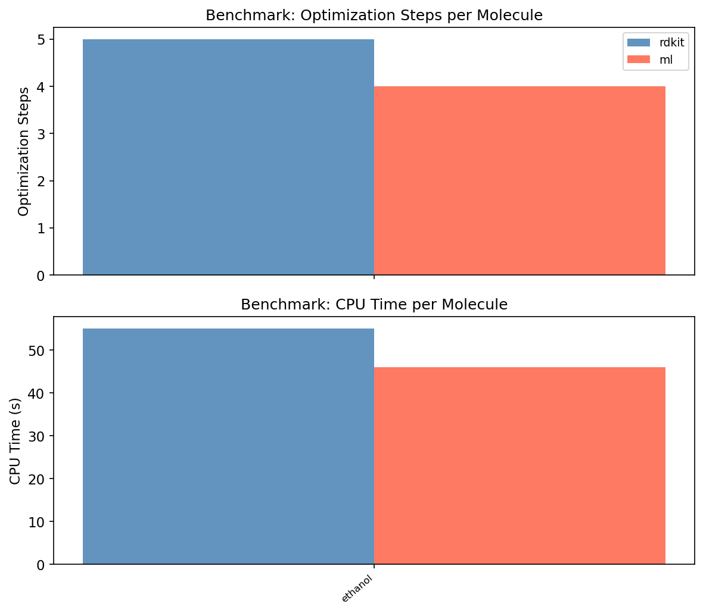

# delta_opt_learning

**MMFF → B3LYP/6-31G(d) 결합 길이 보정을 통한 Gaussian DFT 기하 최적화 가속**

학부 연구 프로젝트 | B3LYP/6-31G(d) | Python · RDKit · xtb · Gaussian 09 · scikit-learn

---

## 개요

Gaussian 09를 이용한 DFT(Density Functional Theory) 기하 최적화는 초기 구조의 품질에 따라 수렴 속도가 크게 달라진다. 일반적으로 사용되는 RDKit ETKDG+MMFF 초기 구조는 간편하지만, MMFF 포스필드의 평형 결합 길이가 B3LYP/6-31G(d) 수준의 값과 체계적인 차이를 보인다.

본 프로젝트는 이 차이를 **Gradient Boosting 머신러닝 모델**로 학습하여, Gaussian 실행 전 초기 구조를 보정함으로써 최적화 스텝 수와 계산 시간을 줄이는 것을 목표로 한다.

---

## 파이프라인

```
SMILES
  │
  ▼
RDKit ETKDG + MMFF 최적화        ← 초기 3D 구조 생성
  │
  ▼
ML Bond Length Correction        ← 결합 유형별 MMFF→DFT 보정
  │
  ▼
Gaussian 09 B3LYP/6-31G(d) opt  ← 실제 DFT 최적화
```

### 빠른 시작

```bash
# 환경 생성
conda env create -f environment.yml
conda run -n delta_chem pip install -e .

# SMILES → Gaussian .com (ML 보정 포함)
conda run -n delta_chem python scripts/pipeline.py "CCO" --name ethanol --ml-correct

# 전체 데이터 수집 (Gaussian 필요)
conda run -n delta_chem python scripts/collect_data.py

# Feature 추출 → 모델 학습 → 벤치마크
conda run -n delta_chem python scripts/extract_features.py
conda run -n delta_chem python scripts/train_model.py
conda run -n delta_chem python scripts/benchmark.py --conditions rdkit ml
```

---

## 방법론

### 1. 훈련 데이터 생성

50종의 단순 유기 분자(알케인, 알켄, 방향족, 헤테로고리, 알코올, 에터, 케톤, 카르복실산, 아민 등)에 대해 두 가지 기하 최적화를 수행하였다.

- **MMFF 구조**: RDKit ETKDGv3 + MMFF94 최적화
- **DFT 구조**: Gaussian 09 B3LYP/6-31G(d) 기하 최적화

두 구조에서 동일한 결합의 길이를 비교하여 보정값 Δ = *d*<sub>DFT</sub> − *d*<sub>MMFF</sub> 를 계산하였다.

### 2. Feature Engineering

결합 1개당 다음 8개의 feature를 추출하였다.

| Feature | 설명 |
|---------|------|
| `elem1`, `elem2` | 결합을 이루는 두 원소 (알파벳 정렬) |
| `bond_order` | 결합 차수 (1.0 / 1.5 / 2.0 / 3.0) |
| `hybridization_1/2` | 각 원자의 혼성 오비탈 (SP / SP2 / SP3) |
| `is_in_ring` | 고리 구성 여부 |
| `ring_size` | 최소 고리 크기 |
| `mmff_length` | MMFF 결합 길이 (Å) |

**예측 목표**: B3LYP/6-31G(d) 결합 길이 (Å)

### 3. 모델

`scikit-learn GradientBoostingRegressor`에 범주형 feature용 `OrdinalEncoder`를 결합한 sklearn `Pipeline`을 사용하였다.

```
하이퍼파라미터: n_estimators=300, max_depth=4, learning_rate=0.05, subsample=0.8
```

---

## 결과

### 데이터셋 (현황)

| 항목 | 값 |
|------|-----|
| 학습 분자 수 | 33개 (50개 수집 진행 중) |
| 학습 결합 수 | 384개 |
| 결합 유형 수 | 13종 |

### 결합 유형별 MMFF → DFT 보정값

| 결합 | n | 평균 보정 (Å) | 표준편차 (Å) |
|------|---|-------------|------------|
| C-C(single) | 59 | **+0.00892** | 0.00629 |
| C-S(aromatic) | 2 | **+0.02452** | — |
| C-C(aromatic) | 42 | +0.00254 | 0.01165 |
| C-H(single) | 238 | +0.00209 | 0.00239 |
| C-O(single) | 17 | −0.00128 | 0.00704 |
| C-C(double) | 3 | −0.00529 | 0.00050 |
| **C=O(double)** | 1 | **−0.01436** | — |
| H-O(single) | 7 | −0.00246 | 0.00104 |

C-C 단결합은 MMFF가 일관되게 짧게 예측하는 반면, C=O는 반대로 길게 예측함을 확인하였다.

### MMFF vs DFT 산점도


### 보정값 분포


### 모델 성능 (5-Fold Cross-Validation)

| Fold | MAE (Å) |
|------|---------|
| 1 | 0.00170 |
| 2 | 0.00281 |
| 3 | 0.00200 |
| 4 | 0.00169 |
| 5 | 0.00236 |
| **평균** | **0.0021 ± 0.0004** |

B3LYP/6-31G(d) 결합 길이 예측 MAE **0.0021 Å** 달성.
일반적인 결합 길이(1.0–1.5 Å) 대비 **0.14% 오차** 수준.

### Feature Importance


`mmff_length`가 98.7%를 차지하며, 현 단계에서 모델은 실질적으로 **결합 유형별 선형 스케일링**을 학습하고 있다. 이는 MMFF와 DFT 간의 체계적 편차(systematic bias)가 지배적임을 의미한다.

### Parity Plot (예측 vs 실제)


### MVP 검증 (에탄올, B3LYP/6-31G(d) opt)



| 조건 | 최적화 스텝 | CPU 시간 |
|------|-----------|---------|
| RDKit (MMFF) | 5 | 55s |
| ML 보정 | **4** | **46s** |
| 단축 | −1 (−20%) | −9s (−16%) |

에탄올은 훈련 데이터에 포함되지 않은 분자로, 모델의 일반화 성능을 확인하였다.

---

## 한계 및 향후 과제

### 현재 한계

1. **데이터 부족**: 현재 33개 분자 / 384개 결합. Feature importance 상 `mmff_length`에 과도하게 의존하여 사실상 선형 보정에 가까움. 주변 원자의 전자적 환경(전기음성도, 공명 구조)에 따른 비선형 보정을 학습하려면 수천 개 결합이 필요.

2. **단순한 feature**: 현재 feature는 국소적(local)이며, 분자 전체의 전자 구조를 반영하지 못함. 이웃 원자의 종류와 수, 부분 전하(partial charge), TPSA 등의 전역적 feature 추가가 필요.

3. **좌표 보정 방식의 한계**: DFS 트리 순회 기반 결합 스케일링은 각 결합을 독립적으로 보정하여, 인접 결합 간의 기하학적 일관성이 보장되지 않음. 각도(bond angle)와 이면각(dihedral angle)은 보정되지 않음.

4. **단순 유기 분자에 한정**: 현재 훈련셋은 C, H, O, N, S, Cl만 포함. 금속 착화합물, 인 함유 화합물, 할로겐 치환체 등은 미검증.

5. **스텝 수의 이산성**: 최적화 스텝은 정수이므로, MAE 0.002 Å 수준의 보정이 스텝 감소로 이어지려면 분자가 충분히 크고 복잡해야 함.

### 향후 과제

- [ ] 50개 분자 Gaussian 계산 완료 후 모델 재학습 및 전체 벤치마크
- [ ] 분자 그래프 신경망(GNN, e.g. DimeNet) 기반 모델로 교체 — 분자 전체 구조를 입력으로 사용
- [ ] 결합 길이뿐 아니라 결합 각도(bond angle) 보정 추가
- [ ] 고리 변형이 심한 구조(strained ring), 수소 결합 존재 분자에서 성능 검증
- [ ] Multi-resolution 최적화(Level 1: MMFF → Level 2: ML 보정 → Level 3: DFT) 전체 파이프라인 완성

---

## 리포지토리 구조

```
delta_opt_learning/
├── src/delta_chem/
│   ├── config.py               # 경로 상수 (G09, xtb)
│   ├── chem/                   # 화학 I/O 모듈
│   │   ├── smiles_to_xyz.py
│   │   ├── gaussian_writer.py
│   │   ├── gaussian_runner.py
│   │   └── log_parser.py
│   ├── ml/                     # ML 모듈
│   │   ├── feature_extractor.py
│   │   ├── train.py
│   │   └── corrector.py
│   └── viz.py                  # 시각화
├── scripts/
│   ├── collect_data.py         # 50개 분자 Gaussian 계산
│   ├── extract_features.py     # .out → bond_features.csv
│   ├── train_model.py          # 모델 학습
│   ├── benchmark.py            # 조건별 비교
│   └── pipeline.py             # SMILES → .com (CLI)
├── figures/                    # 생성된 그래프 및 CSV
├── data/                       # 학습 데이터 (gitignored)
└── models/                     # 학습된 모델 (gitignored)
```

---

## 환경

- Python 3.11, RDKit 2025.9, xtb 6.7.1, scikit-learn 1.4+
- Gaussian 09W (Windows)
- 계산 수준: B3LYP/6-31G(d)
