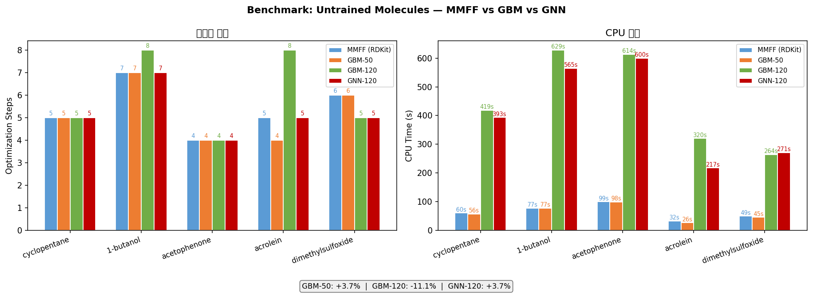

# delta_opt_learning

**MMFF → B3LYP/6-31G(d) 결합 길이 보정을 통한 Gaussian DFT 기하 최적화 가속**

학부 연구 프로젝트 | B3LYP/6-31G(d) | Python · RDKit · Gaussian 16 · scikit-learn · PyTorch

---

## 개요

Gaussian 16을 이용한 DFT(Density Functional Theory) 기하 최적화는 초기 구조의 품질에 따라 수렴 속도가 크게 달라진다. 일반적으로 사용되는 RDKit ETKDG+MMFF 초기 구조는 간편하지만, MMFF 포스필드의 평형 결합 길이가 B3LYP/6-31G(d) 수준의 값과 체계적인 차이를 보인다.

본 프로젝트는 이 차이를 **Gradient Boosting (GBM) 및 Graph Neural Network (GNN) 모델**로 학습하여, Gaussian 실행 전 초기 구조를 보정함으로써 최적화 스텝 수와 계산 시간을 줄이는 것을 목표로 한다.

---

## 파이프라인

```
SMILES
  │
  ▼
RDKit ETKDG + MMFF 최적화        ← 초기 3D 구조 생성
  │
  ▼
ML Bond Length Correction        ← 결합 유형별 MMFF→DFT 보정 (GBM 또는 GNN)
  │
  ▼
Gaussian 16 B3LYP/6-31G(d) opt  ← 실제 DFT 최적화
```

### 빠른 시작

```bash
# 환경 생성
conda env create -f environment.yml
conda run -n delta_chem pip install -e .

# SMILES → Gaussian .com (ML 보정 포함)
conda run -n delta_chem python scripts/pipeline.py "CCO" --name ethanol --ml-correct

# 전체 데이터 수집 (Gaussian 필요)
conda run -n delta_chem python scripts/collect_data.py

# Feature 추출 → GBM 모델 학습
conda run -n delta_chem python scripts/extract_features.py
conda run -n delta_chem python scripts/train_model.py --exclude acetylene --target-mode delta

# GNN 모델 학습
conda run -n delta_chem python scripts/gnn/train_gnn.py

# 벤치마크 (MMFF vs GBM vs GNN)
conda run -n delta_chem python scripts/benchmark_new_mols.py
```

---

## 방법론

### 1. 훈련 데이터 생성

유기 분자에 대해 두 가지 기하를 수집하고 결합별 feature를 추출하였다.

- **MMFF 구조**: Gaussian .out의 `Input orientation` 블록 (실제 제출된 MMFF 구조를 직접 파싱)
- **DFT 구조**: Gaussian 16 B3LYP/6-31G(d) 최적화 후 `Standard orientation` 블록

> **Note:** MMFF 좌표를 ETKDGv3 재실행이 아닌 `Input orientation` 파싱으로 얻음으로써 학습 데이터의 정합성을 보장한다.

### 2. Feature Engineering

결합 1개당 다음 10개의 feature를 추출하였다.

| Feature | 설명 |
|---------|------|
| `elem1`, `elem2` | 결합을 이루는 두 원소 (알파벳 정렬) |
| `bond_order` | 결합 차수 (1.0 / 1.5 / 2.0 / 3.0) |
| `hybridization_1/2` | 각 원자의 혼성 오비탈 (SP / SP2 / SP3) |
| `is_in_ring` | 고리 구성 여부 |
| `ring_size` | 최소 고리 크기 |
| `mmff_length` | MMFF 결합 길이 (Å) |
| `mmff_angle_1/2` | 각 끝점에서의 평균 결합각 (°) ← **v2 추가** |

**예측 목표**: `dft_length - mmff_length` (delta 모드, Å)

> **결합각 feature 의미**: 결합각은 혼성화(hybridization)와 상관계수 r=0.80으로 hybridization 정보를 포함하면서 더 정밀한 기하 정보를 제공한다.

### 3. GBM 모델

`scikit-learn GradientBoostingRegressor`에 범주형 feature용 `OrdinalEncoder`를 결합한 sklearn `Pipeline`.

```
n_estimators=300, max_depth=4, learning_rate=0.05, subsample=0.8
```

### 4. GNN 모델 (Edge-Conditioned MPNN)

분자를 그래프로 표현하여 결합 간 상호작용을 학습하는 메시지 패싱 신경망.

```
노드(원자): 원소 임베딩(16d) + hybridization 임베딩(16d) → 32d
엣지(결합): [bond_order, is_in_ring, ring_size, mmff_length, mmff_angle_1, mmff_angle_2] → 32d
메시지 패싱 3회: h_i += GRU(Σ MLP(h_j || e_ij))
엣지 예측: MLP(h_i || h_j || e_ij) → delta_length
파라미터: 62,001개
```

---

## 데이터셋 진행 현황

| 단계 | 분자 수 | 결합 수 | 상태 |
|------|---------|---------|------|
| Phase 1: 초기 수집 | 50 (acetylene 제외 49) | 529 | 완료 |
| Phase 2: FreeSolv 부분 추가 | +71 → 120 합계 | 1,750 | 완료 |
| **Phase 3: FreeSolv 전체 (642종)** | **진행 중** | **~9,000 예상** | **계산 중 (node02/03)** |

FreeSolv 전체 계산 완료 후 모델 재학습 예정.

---

## 결과

### 모델 성능 비교 (5-Fold CV MAE)

| 모델 | 학습 데이터 | CV MAE (Å) | CV std (Å) | 비고 |
|------|-----------|------------|------------|------|
| GBM (absolute) | 49mol | 0.0026 | 0.0009 | 기준선 |
| GBM (delta) | 49mol | **0.0022** | **0.0003** | 16% 개선 |
| GBM (delta) | 120mol | 0.0029 | 0.0002 | 원소 다양화로 소폭 악화 |
| **GNN (EC-MPNN)** | **120mol** | **0.0048~0.0070** | **0.0009~0.0025** | 데이터 부족으로 GBM 미달 |

> **GNN이 GBM보다 현재 성능이 낮은 이유**: GNN은 수천~수만 분자 규모의 데이터에서 진가가 드러난다. 120분자 수준에서는 트리 기반 GBM이 우위. FreeSolv 전체 완료 후 재비교 예정.

### 훈련 미사용 5개 분자 벤치마크 (Gaussian 최적화 스텝 수)

| 분자 | 작용기 | MMFF | GBM-50 | GBM-120 | GNN-120 |
|------|--------|------|--------|---------|---------|
| cyclopentane | 5원 알케인 | 5 | 5 (=) | 5 (=) | 5 (=) |
| 1-butanol | C4 알코올 | 7 | 7 (=) | 8 (−1) | 7 (=) |
| acetophenone | 방향족 케톤 | 4 | 4 (=) | 4 (=) | 4 (=) |
| acrolein | 공액 카보닐 | 5 | **4 (+1)** | 8 (−3) | 5 (=) |
| dimethylsulfoxide | S=O | 6 | 6 (=) | **5 (+1)** | **5 (+1)** |

- **GBM-50** 최선: acrolein 1스텝 개선
- **GBM-120** 문제: acrolein에서 3스텝 증가 (원소 다양화 역효과)
- **GNN**: DMSO 1스텝 개선, acrolein은 개선 없음



### 기하 왜곡 분석

DFS 기반 좌표 보정이 결합각/이면각에 미치는 영향을 정량화하였다 (`scripts/analyze_geometry.py`).

| 지표 | 값 |
|------|-----|
| 결합각 MAE | 0.73° |
| 이면각 MAE | 2.45° |
| Conformer 변화율 | 0.5% |

> GNN corrector는 RDKit `SetBondLength` (BFS 순서)를 사용하여 DFS 방식보다 결합각 보존 성능을 개선하였다.

### 타겟 모드 비교: Absolute vs Delta

| 타겟 모드 | CV MAE (Å) | CV std (Å) | mmff_length 중요도 |
|-----------|-----------|-----------|-----------------|
| absolute | 0.00261 | 0.00088 | 98.3% |
| **delta** | **0.00219** | **0.00043** | **81.3%** |

Delta 모드에서 `bond_order`(7.3%), `elem2`(5.5%), `ring_size`(2.7%) 등 화학적 feature 기여가 증가하였다.


### Feature Importance (GBM delta 모드)


### Parity Plot


---

## 현재 상황 분석 (`crit.md` 요약)

### 핵심 문제

1. **DFS 좌표 보정 왜곡**: 결합 길이 예측 정확도(MAE 0.002 Å)는 충분하나, DFS 순회 방식이 결합각/이면각을 왜곡하여 acrolein 등 공액 분자에서 역효과 발생
2. **Feature 중복**: `hybridization` ↔ `mmff_angle` (r=0.80), `is_in_ring` ↔ `ring_size` (r=1.00)
3. **GNN 데이터 부족**: 120분자 규모에서 GNN은 GBM 대비 우위 없음 → FreeSolv 642분자 완료 후 재평가 필요

### 우선순위 로드맵

| 우선순위 | 작업 | 상태 |
|----------|------|------|
| 1 | FreeSolv 전체 642분자 계산 | **진행 중** |
| 2 | 전체 데이터로 GBM/GNN 재학습 | 대기 중 |
| 3 | Feature 정리 (hybridization 제거, 이웃 문맥 추가) | 대기 중 |
| 4 | Equivariant GNN (3D 좌표 직접 예측) | 장기 목표 |

---

## 리포지토리 구조

```
delta_opt_learning/
├── src/delta_chem/
│   ├── config.py               # 경로 상수 (G16_EXE, GAUSS_EXEDIR)
│   ├── chem/
│   │   ├── smiles_to_xyz.py    # SMILES → MMFF XYZ, mol_to_xyz 유틸리티
│   │   ├── gaussian_writer.py  # XYZ → Gaussian .com
│   │   ├── gaussian_runner.py  # Gaussian 16 subprocess 실행
│   │   └── log_parser.py       # .out 파싱 (steps/time/geometry)
│   └── ml/
│       ├── feature_extractor.py # MMFF+DFT 좌표 → bond feature DataFrame
│       ├── train.py             # GradientBoosting 학습 (delta 모드)
│       └── corrector.py         # GBM 보정 적용 (DFS 방식, 모델 캐싱)
├── scripts/
│   ├── collect_data.py         # 초기 50개 분자 Gaussian 계산
│   ├── collect_freesolv.py     # FreeSolv 642분자 Gaussian 계산 (SGE 지원)
│   ├── extract_features.py     # .out → bond_features.csv
│   ├── train_model.py          # GBM 모델 학습
│   ├── analyze_geometry.py     # 결합각/이면각 왜곡 분석
│   ├── compare_target_modes.py # absolute vs delta 비교
│   ├── benchmark_new_mols.py   # 4-way 벤치마크 (MMFF/GBM-50/GBM-120/GNN)
│   ├── benchmark_acetylene.py  # Acetylene 케이스 스터디
│   ├── benchmark.py            # 조건별 비교
│   ├── pipeline.py             # SMILES → .com CLI
│   ├── sge_freesolv_node1.sh   # SGE 잡 스크립트 (node02, idx 0-321)
│   ├── sge_freesolv_node2.sh   # SGE 잡 스크립트 (node03, idx 321-642)
│   └── gnn/
│       ├── dataset.py          # bond_features.csv → PyG Data 그래프
│       ├── model.py            # EC-MPNN 아키텍처 (62,001 파라미터)
│       ├── train_gnn.py        # GNN 학습 (5-Fold CV)
│       ├── corrector_gnn.py    # GNN 보정 적용 (SetBondLength 방식)
│       └── sge_train_gnn.sh    # SGE 잡 스크립트 (GNN 학습용)
├── crit.md                     # 현황 비판적 분석 및 로드맵
├── figures/                    # 생성된 그래프 및 CSV (01~09)
├── data/                       # 학습 데이터 (gitignored)
│   ├── raw/                    # Gaussian .out/.log 파일
│   ├── features/               # bond_features*.csv
│   └── FreeSolv_SAMPL.csv      # FreeSolv 데이터셋 (642분자)
└── models/                     # 학습된 .joblib 모델 (gitignored)
    ├── bond_length_corrector_delta.joblib          # GBM-50
    ├── bond_length_corrector_delta_expanded.joblib # GBM-120
    └── bond_length_corrector_gnn.joblib            # GNN-120
```

---

## 환경

- Python 3.11, RDKit, scikit-learn 1.5.2, PyTorch 2.6.0, PyTorch Geometric 2.7.0
- Gaussian 16 (`/opt/gaussian/g16/g16`)
- 서버: CentOS 7, 20코어, RAM 62GB
- 계산 수준: B3LYP/6-31G(d), `#p opt freq`
- SGE 클러스터: 20core.q (node02~06), 40core.q (node07~20)
